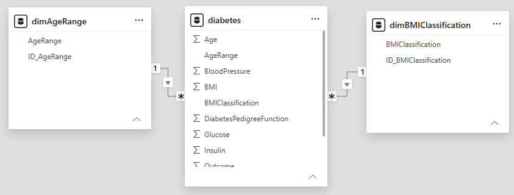
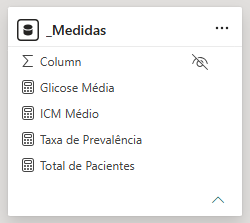

# Análise do Dataset de Diabetes com Power BI

## Etapas de ETL (Extraction, Transformation, and Load)

### Transformação dos Dados

Após o carregamento inicial, identificou-se a presença de valores iguais a **zero** em variáveis fisiológicas fundamentais: **Glicose**, **Pressão Arterial**, **Dobra Cutânea**, **Insulina** e **IMC**. Em uma análise médica, esses zeros configuram dados ausentes (*missing values*), visto que são biologicamente incompatíveis com a vida. 

Devido à assimetria na distribuição dessas variáveis (presença de *outliers* e desvios), optou-se por substituir os valores zerados pela **mediana** dos valores válidos ($>0$) de cada coluna respectiva.

Adicionalmente, foram criadas colunas de categorização para as variáveis de Idade (`AgeRange`) e IMC (`BMIClassification`) utilizando códigos numéricos de chave estrangeira para otimizar a modelagem relacional.

No **Editor Avançado do Power Query**, o código M aplicado foi:

```powerquery
let
    Fonte = Csv.Document(File.Contents("D:\Projetos\Github\costandrad\DIO\Universia - Primeiros Passos em Power BI\02 - Fundamentos de BI\datasets\diabetes.csv"), [Delimiter=",", Columns=9, Encoding=1252, QuoteStyle=QuoteStyle.None]),
    #"Cabeçalhos Promovidos" = Table.PromoteHeaders(Fonte, [PromoteAllScalars=true]),
    #"Tipo Alterado" = Table.TransformColumnTypes(#"Cabeçalhos Promovidos", {{"Pregnancies", Int64.Type}, {"Glucose", Int64.Type}, {"BloodPressure", Int64.Type}, {"SkinThickness", Int64.Type}, {"Insulin", Int64.Type}, {"BMI", type number}, {"DiabetesPedigreeFunction", type number}, {"Age", Int64.Type}, {"Outcome", Int64.Type}}),
    
    // Imputação de zeros pela mediana dos valores válidos (>0)
    #"Glucose Mediana" = Table.ReplaceValue(#"Tipo Alterado", 0, List.Median(List.Select(#"Tipo Alterado"[Glucose], each _ <> 0 and _ <> null)), Replacer.ReplaceValue, {"Glucose"}),
    #"BloodPressure Mediana" = Table.ReplaceValue(#"Glucose Mediana", 0, List.Median(List.Select(#"Glucose Mediana"[BloodPressure], each _ <> 0 and _ <> null)), Replacer.ReplaceValue, {"BloodPressure"}),
    #"SkinThickness Mediana" = Table.ReplaceValue(#"BloodPressure Mediana", 0, List.Median(List.Select(#"BloodPressure Mediana"[SkinThickness], each _ <> 0 and _ <> null)), Replacer.ReplaceValue, {"SkinThickness"}),
    #"Insulin Mediana" = Table.ReplaceValue(#"SkinThickness Mediana", 0, List.Median(List.Select(#"SkinThickness Mediana"[Insulin], each _ <> 0 and _ <> null)), Replacer.ReplaceValue, {"Insulin"}),
    #"BMI Mediana" = Table.ReplaceValue(#"Insulin Mediana", 0, List.Median(List.Select(#"Insulin Mediana"[BMI], each _ <> 0 and _ <> null)), Replacer.ReplaceValue, {"BMI"}),
    
    // Categorização das variáveis Age e BMI para vinculação com Dimensões
    #"Categorização Age" = Table.AddColumn(#"BMI Mediana", "ID_AgeRange", each if [Age] < 30 then 1 else if [Age] < 50 then 2 else 3, Int64.Type),
    #"Categorização BMI" = Table.AddColumn(#"Categorização Age", "ID_BMIClassification", each if [BMI] < 25 then 1 else if [BMI] < 30 then 2 else 3, Int64.Type)
in
    #"Categorização BMI"
```

## Modelagem e Tabelas Dimensão

Para seguir as boas práticas de modelagem em estrela (*Star Schema*), as codificações numéricas geradas na transformação foram relacionadas a duas tabelas dimensão dedicadas:

* `dimAgeRange` (Dimensão de Faixa Etária)

| ID_AgeRange | AgeRange |
| :---: | :---: |
| 1 | < 30 anos |
| 2 | 30 a 49 anos |
| 3 | 50+ anos |

* `dimBMIClassification` (Dimensão de Classificação do IMC)

| ID_BMIClassification | BMIClassification |
| :---: | :---: |
| 1 | Normal |
| 2 | Overweight |
| 3 | Obesity |



## Medidas DAX Criadas

As métricas do projeto foram organizadas em uma tabela exclusiva chamada `_Medidas`.

* **Total de Pacientes** (Volume total da amostra):
```dax
Total de Pacientes = COUNTROWS('diabetes')
```

* **Taxa de Prevalência** (Proporção de diagnósticos positivos para diabetes):
```dax
Taxa de Prevalência = 
DIVIDE(
    CALCULATE(COUNTROWS('diabetes'), 'diabetes'[Outcome] = 1),
    [Total de Pacientes],
    0
)
```

* **Glicose Média** (Concentração média de glicose plasmática):
```dax
Glicose Média = 
CALCULATE(
    AVERAGE('diabetes'[Glucose]),
    'diabetes'[Glucose] > 0
)
```

* **IMC Médio** (Índice de Massa Corporal médio):
```dax
IMC Médio = 
CALCULATE(
    AVERAGE('diabetes'[BMI]), 
    'diabetes'[BMI] > 0
)
```

