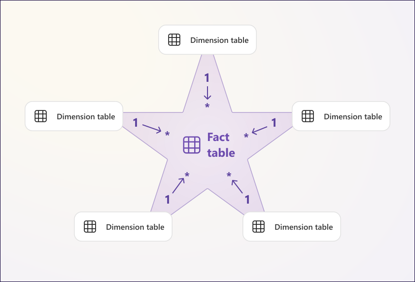
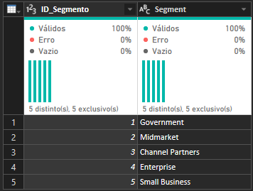
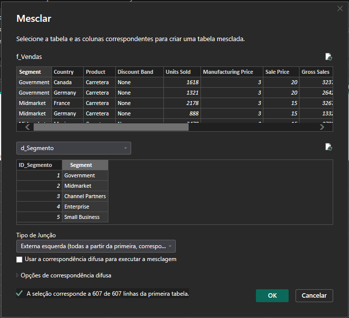
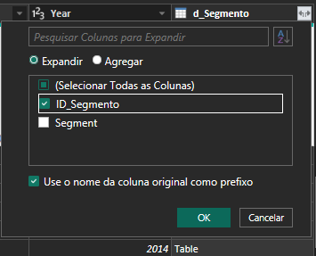

# Desafio de Projeto

## Modelagem de dashboard de e-comerce com Power BI utilizando fórmulas DAX

* **Contexto**: Para este desafio de projeto, a base de dados utilizada foi a pasta de trabalho do Excel [Financial Sample](https://go.microsoft.com/fwlink/?LinkID=521962). O desafio consiste em desenvolver e implementar o **Modelo de Esquema em Estrela** (_Star Schema_) e criar uma tabela fato e tabelas dimensão apropriadas a partir dos dados originais.

## Definições Úteis

### Modelo de Esquema em Estrela (_Star Schema_)


O Modelo de Esquema em Estrela (_Star Schema_) é um modelo de organização de banco de dados mais simples, cujo objetivo é organizar grandes conjuntos de dados de forma intuitiva e voltada para otimizar a Análise de Dados e _Business Intelligence_ ([^1]). O modelo requer uma tabela central, denomidada **tabela fato**, em torno da qual ficam conectadas  várias **tabelas dimensão**, daí o nome _Star Schema_ ([^2]).

#### Tabela de Fatos

- A **tabela de fatos** é o centro do esquema em estrela que armazena os dados numéricos e mensuráveis (vendas, lucro) dos eventos/transações. Possui muitas linhas, poucas colunas e conecta-se às dimensões por meio de chaves estrangeiras.
- As **tabelas de dimensão** ficam ao redor da fato e fornecem o contexto qualitativo (quem, o quê, quando, onde). Possuem menos linhas e mais colunas, armazenando atributos detalhados para interpretar os fatos.

Conforme [documentação da Microsoft](https://learn.microsoft.com/pt-br/power-bi/guidance/star-schema), "uma tabela fato contém colunas de chave de dimensão, que se relacionam a tabelas de dimensão, e colunas de medida numérica. As colunas de chave de dimensão determinam a _dimensionalidade_ de uma tabela de fatos, enquanto os valores de chave de dimensão determinam a _granularidade_ de uma tabela de fatos". Além disso,

- As tabelas de dimensões permitem a _filtragem_ e o _agrupamento_.
- As tabelas de fatos permitem o _resumo_.

<div style="max-width: 500px; font-family: sans-serif; text-align: center">
  <figcaption>Design de modelo de esquema em estrela</figcaption>
  
  <small style="display: block; text-align: left; color: #666; margin-top: 5px;">
    Fonte: <a href="https://learn.microsoft.com/pt-br/power-bi/guidance/star-schema">Microsoft</a>
  </small>
</div>


## Preparação dos dados

Após abrir a pasta de trabalho Excel no Power BI, foi realizada uma preparação inicial dos dados do Editor Power Query, conforme descrito abaixo:

1. Com o Editor Power Query aberto, foi observada que a coluna `Unit Solds` estava no formato de "Número Decimal". Como tal formato não faz sentido, o tipo de dado dessa coluna foi alterado para "Número Inteiro".

2. Conforme [tutorial oficial Microsoft](https://learn.microsoft.com/pt-br/power-bi/create-reports/desktop-excel-stunning-report) para criação de relatório a partir dessa base de dados, o produto **Montana** foi descontinuado. Então, na coluna `Product`, foi aplicada uma filtragem para exclusão dos registros relativos a esse produto.

3. As colunas `Manufacturing Price`, `Sale Price`, `Gross Sales`, `Discounts`, `Discounts`, `Sales`, `COGS`, `Profit` foram convertidas para "Número decimal fixo", visto que são valores monetários.

A tabela seguinte mostra as colunas do dataset original e os repectivos tipos de dados:

| Campo | Tipo de Dado | Descrição |
| :--- | :--- | :--- |
| `Segment` | Texto | Segmento de mercado ao qual o cliente pertence (ex.: *Government*, *Small Business*, *Enterprise*). |
| `Country` | Texto | País onde a venda foi realizada. |
| `Product` | Texto | Nome do produto comercializado (com exclusão do produto descontinuado *Montana* via filtro). |
| `Discount Band` | Texto | Categoria ou faixa de desconto aplicada à transação (ex.: *None*, *Low*, *Medium*, *High*). |
| `Units Sold` | Número Inteiro | Quantidade total de unidades vendidas do produto na transação. |
| `Manufacturing Price` | Número decimal fixo | Custo unitário de fabricação do produto. |
| `Sale Price` | Número decimal fixo | Preço unitário de venda do produto. |
| `Gross Sales` | Número decimal fixo | Valor total das vendas brutas ($\text{Unidades Vendidas} \times \text{Preço de Venda}$). |
| `Discounts` | Número decimal fixo | Valor total em desconto concedido na transação. |
| ` Sales` | Número decimal fixo | Valor líquido total da venda ($\text{Vendas Brutas} - \text{Descontos}$). |
| `COGS` | Número decimal fixo | Custo dos Produtos Vendidos (*Cost of Goods Sold*), representando o custo total de produção das unidades vendidas. |
| `Profit` | Número decimal fixo | Lucro líquido obtido na transação ($\text{Vendas Líquidas} - \text{COGS}$). |
| `Date` | Data | Data em que a transação de venda foi efetuada. |
| `Month Number` | Número Inteiro | Número ordinal correspondente ao mês da venda (1 a 12). |
| `Month Name` | Texto | Nome por extenso do mês em que a venda foi realizada. |
| `Year` | Número Inteiro | Ano de realização da transação (ex.: 2013, 2014). |

## Modelagem em Esquema Estrela

Considerando as definições acerca do modelo em esquema estrela, optou-se por uma estrutura levemente diferente do proposto na [descrição do desafio](./00-docs/Descrição%20%20do%20Desafio%20-%20Modelagem%20e%20Transformação%20de%20dados%20com%20DAX%20com%20Power%20BI.pdf). 


### Tabelas de Dimensão

As **tabelas Dimensão** modeladas foram: `d_Segmento`, `d_Geografia`, `d_Produto`, `d_Faixa_Desconto` e `d_Calendario` conforme detalhamento a seguir. 

As tabelas dimensão (`d_Segmento`, `d_Geografia`, `d_Produto` e `d_Faixa_Desconto`) foram criadas no Editor Power Query a partir da referência da base original. Para cada uma, selecionou-se a coluna correspondente, removeram-se as duplicadas e gerou-se uma coluna de índice como chave primária.

A tabela `d_Calendario` foi criada via código DAX


#### Dimensão Segmento

O Código detalha as Etapas Aplicadas no Editor Power Query:

```powerquery
let
    Fonte = Excel.Workbook(File.Contents("D:\Projetos\Github\costandrad\DIO\universia-primeiros-passos-com-power-bi\05 - Modelagem de Dados com Power BI\Desafio de Projeto - Modelagem de dashboard de e-comerce\01-database\Financial Sample.xlsx"), null, true),
    financials_Table = Fonte{[Item="financials",Kind="Table"]}[Data],
    #"Tipo Alterado" = Table.TransformColumnTypes(financials_Table,{{"Segment", type text}, {"Country", type text}, {"Product", type text}, {"Discount Band", type text}, {"Units Sold", type number}, {"Manufacturing Price", Int64.Type}, {"Sale Price", Int64.Type}, {"Gross Sales", type number}, {"Discounts", type number}, {" Sales", type number}, {"COGS", type number}, {"Profit", type number}, {"Date", type date}, {"Month Number", Int64.Type}, {"Month Name", type text}, {"Year", Int64.Type}}),
    #"Outras Colunas Removidas" = Table.SelectColumns(#"Tipo Alterado",{"Segment"}),
    #"Duplicatas Removidas" = Table.Distinct(#"Outras Colunas Removidas"),
    #"Índice Adicionado" = Table.AddIndexColumn(#"Duplicatas Removidas", "Índice", 1, 1, Int64.Type),
    #"Colunas Reordenadas" = Table.ReorderColumns(#"Índice Adicionado",{"Índice", "Segment"}),
    #"Colunas Renomeadas" = Table.RenameColumns(#"Colunas Reordenadas",{{"Índice", "ID_Segmento"}})
in
    #"Colunas Renomeadas"
```

O resulado foi o seguinte:

<div style="max-width: 300px; font-family: sans-serif; text-align: center">
  <figcaption>Tabela d_Segmento</figcaption>
  
  <small style="display: block; text-align: left; color: #666; margin-top: 5px;">
    Fonte: <a href="https://learn.microsoft.com/pt-br/power-bi/guidance/star-schema">Autor</a>
  </small>
</div>


| Campo | Tipo de Dado | Chave |
| :--- | :--- | :--- |
| `ID_Segmento` | Número Inteiro | PK |
| `Segmento` | Texto | |


#### Dimensão Geografia

| Campo | Tipo de Dado | Chave |
| :--- | :--- | :--- |
| `ID_Pais` | Número Inteiro | PK |
| `Pais` | Texto | |

#### Dimensão Produto

| Campo | Tipo de Dado | Chave |
| :--- | :--- | :--- |
| `ID_Produto` | Número Inteiro | PK |
| `Nome_Produto` | Texto | |
| `Preco_Fabricacao_Padrao` | Número decimal fixo | |


#### Dimensão Faixa de Desconto

| Campo | Tipo de Dado | Chave |
| :--- | :--- | :--- |
| `ID_Faixa_Desconto` | Número Inteiro | PK |
| `Faixa_Desconto` | Texto | |

#### Dimensão Calenário

| Campo | Tipo de Dado | Chave |
| :--- | :--- | :--- |
| `Data` | Data | PK |
| `Ano` | Número Inteiro | |
| `Numero_Mes` | Número Inteiro | |
| `Nome_Mes` | Texto | |


### Tabela de Fatos

A **Tabela de Fatos** `f_Vendas` foi criada com a seguinte estrutura, a fim de representar os eventos relacionados às vendas:

| Campo | Tipo de Dado | Chave |
| :--- | :--- | :--- |
| `ID_Venda` | Número Inteiro | PK |
| `ID_Produto` | Número Inteiro | FK |
| `ID_Pais` | Número Inteiro | FK |
| `ID_Segmento` | Número Inteiro | FK |
| `ID_Faixa_Desconto` | Número Inteiro | FK |
| `Data` | Data | FK |
| `Unidades_Vendidas` | Número Inteiro | |
| `Preco_Venda` | Número decimal fixo | |
| `Vendas_Brutas` | Número decimal fixo | |
| `Descontos` | Número decimal fixo | |
| `Vendas_Liquidas` | Número decimal fixo | |
| `COGS` | Número decimal fixo | |
| `Lucro` | Número decimal fixo | |

Construção da Tabela Fato (`f_Vendas`):

1. Criação da Base: A partir da tabela original (`financials`), gerou-se a consulta `f_Vendas` .

2. Mesclagem de Consultas (Merge): Para cada dimensão (`d_Segmento`, `d_Geografia`, `d_Produto`, `d_Faixa_Desconto`), realizou-se a junção com a tabela fato utilizando a coluna de atributo correspondente (ex.: `Segment` com `Segment`).

<div style="max-width: 600px; font-family: sans-serif; text-align: center">
  <figcaption>Mesclagem de consultas da tabela d_Segmento</figcaption>
  
  <small style="display: block; text-align: left; color: #666; margin-top: 5px;">
    Fonte: <a href="https://learn.microsoft.com/pt-br/power-bi/guidance/star-schema">Autor</a>
  </small>
</div>

3. Expansão das Chaves: De cada tabela mesclada, expandiu-se apenas a coluna do ID correspondente (`ID_Segmento`, `ID_Pais`, `ID_Produto`, `ID_Faixa_Desconto`).

<div style="max-width: 300px; font-family: sans-serif; text-align: center">
  <figcaption>Expansão de chaves da tabela d_Segmento para f_Vendas</figcaption>
  
  <small style="display: block; text-align: left; color: #666; margin-top: 5px;">
    Fonte: <a href="https://learn.microsoft.com/pt-br/power-bi/guidance/star-schema">Autor</a>
  </small>
</div>

4. Limpeza e Otimização: As colunas textuais originais foram removidas, garantindo que a tabela fato armazene apenas as Chaves Estrangeiras (FK) e as colunas numéricas/fatos (vendas, custos, unidades, lucro).


## Referências

[^1]: https://www.snowflake.com/pt_br/fundamentals/star-schema/

[^2]: https://learn.microsoft.com/pt-br/power-bi/guidance/star-schema